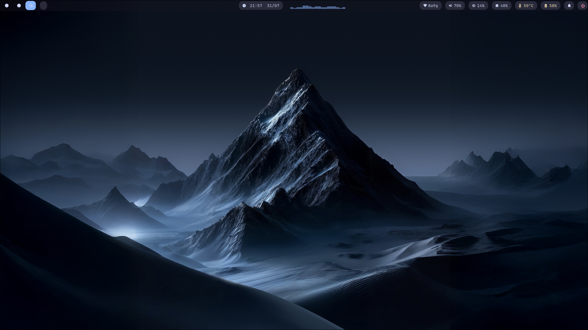
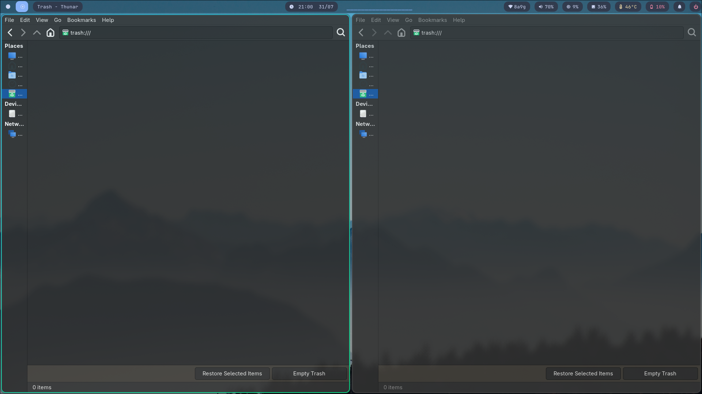
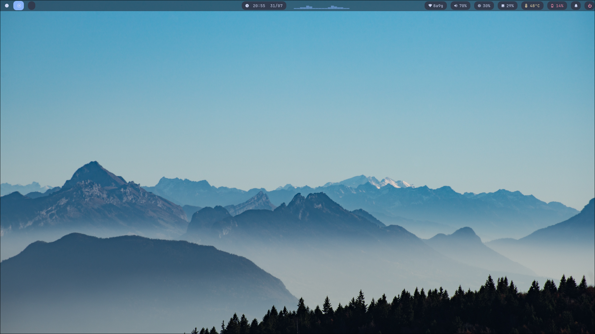
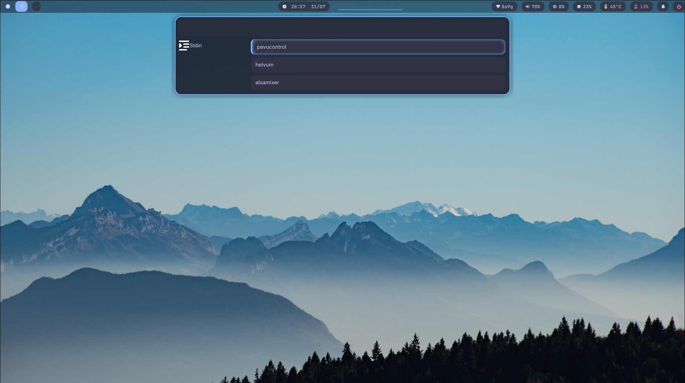
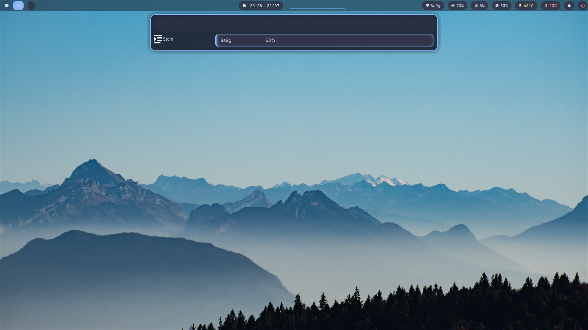
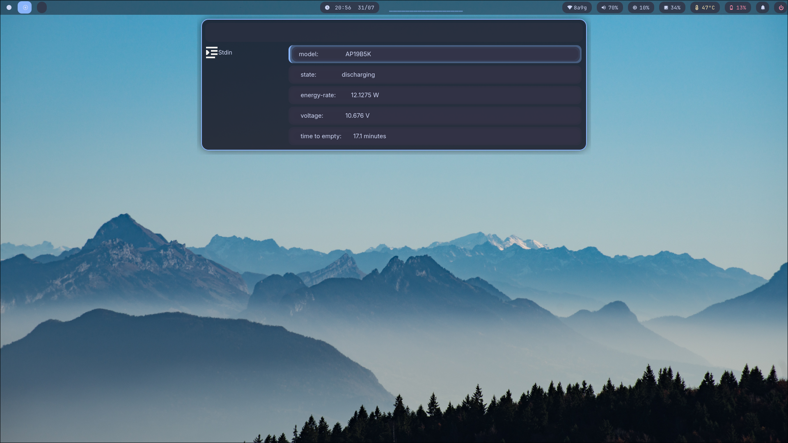
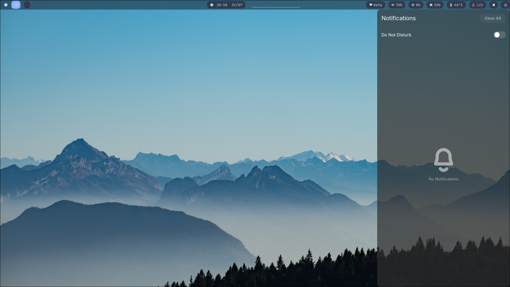
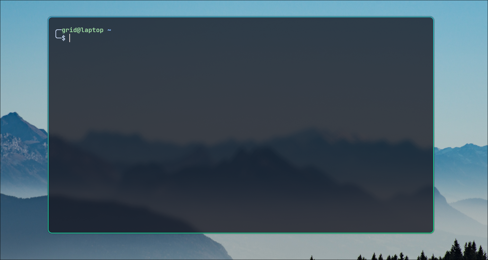
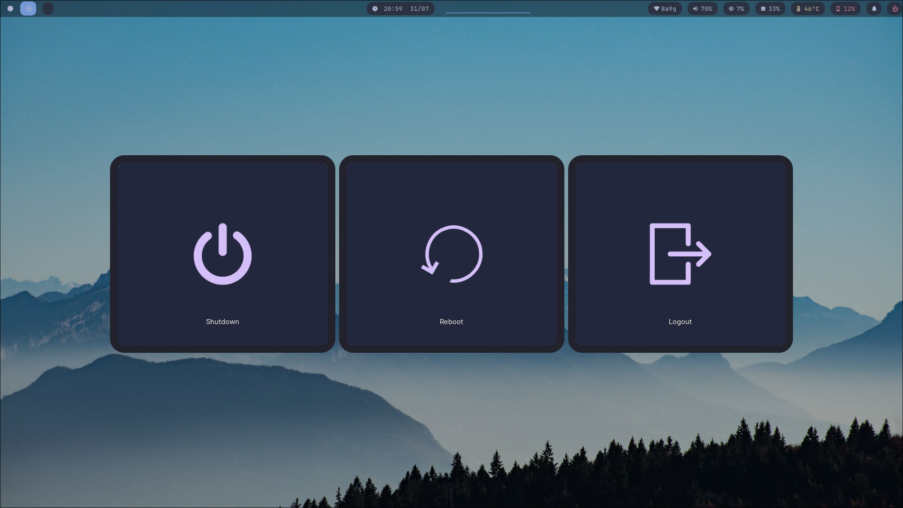

<p align="center">
  
</p>

<h1 align="center">HyprHUB Dots</h1>

<p align="center">
Modern • Minimal • Fast • Beautiful
</p>


---


## ✨ Features

- Modern Hyprland configuration
- Smooth animations
- Waybar
- Anyrun launcher
- Kitty terminal
- Wlogout
- SwayNC notifications
- Cava audio visualizer
- Waypaper wallpaper manager
- Clipboard history
- Audio controls
- Brightness controls
- Multi-workspace support
- Window rules
- Blur & rounded corners

---

## 📸 Screenshots

| Desktop | Waybar |
|---------|---------|
|  |  |

| Audio | Wi-Fi |
|--------|--------|
|  |  |

| Battery | Notification |
|----------|--------------|
|  |  |

| Kitty | Wlogout |
|--------|----------|
|  |  |

---

# 📂 Repository Structure

```
.
├── anyrun/        # Launcher configuration
├── .local/bin/    # Utility scripts
├── cava/          # Audio visualizer
├── gtk-3.0/       # GTK3 settings
├── gtk-4.0/       # GTK4 settings
├── hypr/          # Hyprland configuration
├── kitty/         # Kitty terminal
├── rofi/          # Rofi theme
├── screenshots/   # Project screenshots
├── scripts/       # Helper scripts
├── themes/        # Theme files
├── waybar/        # Waybar configuration
├── waypaper/      # Wallpaper manager
├── wlogout/       # Logout menu
└── install.sh
```

---

# 📦 Dependencies

Install these packages before using HyprHUB.

- hyprland
- kitty
- anyrun
- waybar
- wlogout
- swaync
- swayosd
- wl-clipboard
- cliphist
- grim
- slurp
- brightnessctl
- playerctl
- cava
- waypaper
- thunar

---

# 🚀 Installation

Clone the repository.

```bash
git clone https://github.com/hyprHub/hyprhub-dots.git
```

Go into the project.

```bash
cd hyprhub-dots
```

Run the installer.

```bash
chmod +x install.sh
./install.sh
```

---

# ⌨ Default Keybindings

| Key | Action |
|------|--------|
| SUPER + Enter | Open Terminal |
| SUPER + E | File Manager |
| SUPER + Q | Close Window |
| SUPER + L | Toggle Floating |
| SUPER + S | Special Workspace |
| SUPER + Shift + S | Move To Special Workspace |
| SUPER + Arrow | Change Focus |
| SUPER + Shift + Arrow | Move Window |
| XF86AudioRaiseVolume | Volume Up |
| XF86AudioLowerVolume | Volume Down |
| XF86AudioMute | Toggle Mute |
| XF86MonBrightnessUp | Brightness Up |
| XF86MonBrightnessDown | Brightness Down |

---

# ⚙ Customization

Applications can be changed inside:

```
hypr/hyprland.lua
```

```lua
local terminal = "kitty"
local fileManager = "thunar"
local browser = "firefox"
local launcher = "anyrun"
local editor = "code"
```

---

# 🛠 Included Components

- Hyprland
- Waybar
- Anyrun
- Kitty
- Cava
- Wlogout
- GTK Settings
- Waypaper
- Utility Scripts

---

# 📄 Documentation

| File | Description |
|------|-------------|
| README.md | Project documentation |
| LICENSE | MIT License |
| CHANGELOG.md | Version history |
| CONTRIBUTING.md | Contribution guide |
| CODE_OF_CONDUCT.md | Community rules |
| SECURITY.md | Security policy |

---

# 🤝 Contributing

Contributions are welcome. Feel free to open an Issue or Pull Request.

---

# ⭐ Support

If you like this project, consider giving it a star on GitHub.

---

# 📜 License

This project is licensed under the MIT License.
